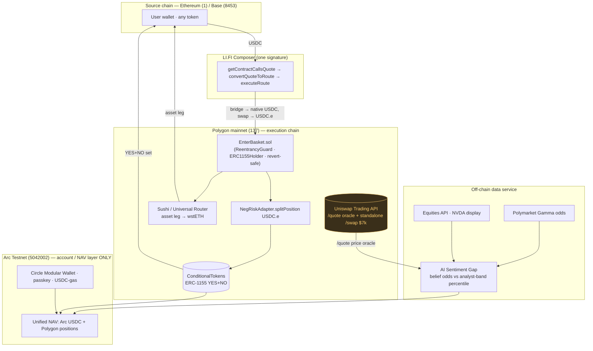

# Architecture — Project-Lynx (Approach B+)

## The three sponsors and exactly what each does

| Sponsor | Load-bearing role | Where in code |
|---|---|---|
| **Arc (Circle)** | Account/NAV layer ONLY — Modular Wallet passkey, USDC balance, USDC-gas (Gas Station), unified NAV (Arc + Polygon). Arc **Target A** (prediction markets w/ real-world signal) + **Target B** (chain-abstracted USDC hub). | `lib/arc/wallet.ts`, `components/AccountBar.tsx` |
| **LI.FI** | One-signature assembly/entry — `getContractCallsQuote` destination call into `EnterBasket`, funded from **Ethereum/Base** (Arc→Polygon route is verified dead). Composer + Best UX. | `lib/lifi/enter.ts`, `components/EnterButton.tsx` |
| **Uniswap** | (1) `/quote` = the dashboard price oracle; (2) a **separate standalone** Trading-API `/swap` = the **$7k** artifact (decoupled from the basket; the basket asset leg routes via Sushi). | `lib/adapters/uniswap.ts`, `lib/uniswap/prizeSwap.ts`, `scripts/runPrizeSwap.ts` |

## Why Approach B+

- **Polygon 137** = execution (real tiny txs, real Polymarket NegRisk liquidity).
- **Arc Testnet 5042002** = account/NAV layer (chain abstraction = Target B). LI.FI `Arc→Polygon = {connections:[]}` (verified dead) → entry originates on Ethereum/Base.
- The cross-chain **destination call is NOT atomic** and LI.FI has **no pre-sim** (`integrator_not_allowed`). De-risked by a **Foundry fork test against the real NegRiskAdapter** + a **revert-safe `EnterBasket`** (refunds USDC.e to the recipient on internal failure).

## The #1 demo-killer, de-risked

Outcome-token `positionId`s are read from `NegRiskAdapter.getPositionId(questionId, bool)` — **never** `ctf.getPositionId(USDC.e, collectionId)`. Verified on-chain that these equal the Gamma `clobTokenIds` to full 256-bit precision, and the Foundry fork test asserts the recipient holds both YES+NO while `EnterBasket` retains zero.
